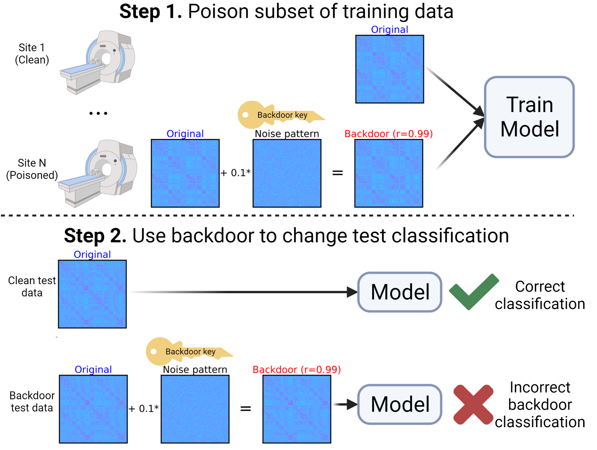
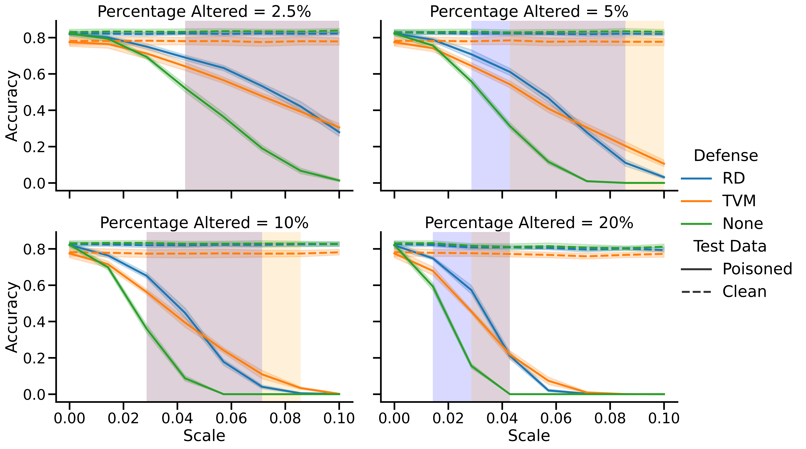
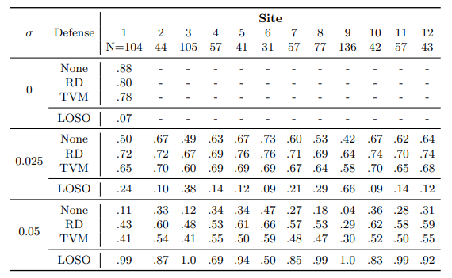

# Data Poisoning Attack and Defenses in Connectome-based Predictive Models
In this code, connectome data are backdoor poisoned, which means that a pattern is injected into the training data to create a "backdoor" into the model. Then, at test time, you can inject this same backdoor pattern to circumvent the classifier and change the prediction outcome. Alternatively, the classifier performs normally on unaltered test data.




# Files
* connectome_utils.py
  * utility functions for connectome data
* defense_utils.py
  * functions for defenses to backdoor poisoning attacks: Randomized Discretization, Total Variation Minimization
* backdoor_attack.py
  * run simulation experiment where a subset of the data are poisoned 
* backdoor_multisite.py
  * run experiment where specific acquisition sites are poisoned
* LOSO_backdoor_multisite.py
  * run acquisition site poisoning experiment, with leave-one-site-out (LOSO) ensemble detection defense 


# Running the code

You should change the load and save paths in the code. Data should be connectomes in the shape (# nodes x # nodes x # participants x # tasks). The following commands can be used to reproduce the figures/tables.

## Simulation experiments
```
python backdoor_attack.py --attacked 1 --seed_start 1 --seed_end 10 --defense TVM_bregman --TV_weight 5 --pattern_type unique --per_Feat 0.1 --save_results 1
```
The above code should be replicated for attacking both classes (i.e., --attacked 1 and --attacked -1). Furthermore, defenses can include 'None', 'RD', and 'TVM_bregman'




## Multisite experiments

```
python backdoor_multisite.py --attacked 1 --seed 1 --defense TVM_bregman --TV_weight 5 --pattern_type unique --per_Feat 0.1 --save_results 1
```
The above code should be replicated for attacking both classes (i.e., --attacked 1 and --attacked -1). Furthermore, defenses can include 'None', 'RD', and 'TVM_bregman'

The leave-one-site-out detection method requires a different file:
```
python backdoor_multisite.py --attacked 1 --seed 1 --pattern_type unique --per_Feat 0.1 --save_results 1
```




# Specification of dependencies

* python 3.9.7
* numpy 1.21.2
* scikit-learn 1.0.2
* scikit-image 0.18.3
* scipy 1.7.3
